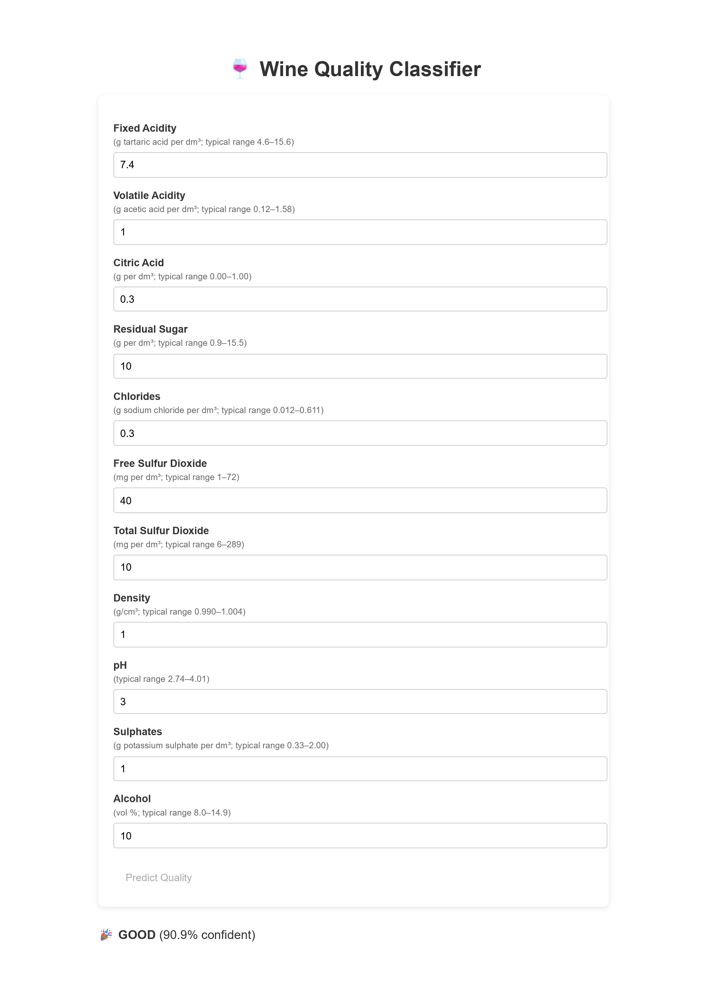

# 🍷 Wine Quality Classifier API

<p align="center">
  
</p>




An interactive FastAPI microservice that classifies red wine samples as **good** or **not good** based on physicochemical properties, complete with a browser-based UI for real-time predictions.

---

## 🚀 Features

- **REST API** (`/predict`):  
  - Accepts JSON input of 11 features  
  - Returns a class label and confidence score  
- **Web Interface** (`/`):  
  - Simple, clean HTML form served from the API  
  - Instant results without external tooling  
- **Model**:  
  - PyTorch fully connected network (`WineNet`)  
  - Trained on the UCI Wine Quality dataset (red wine)  
- **One-click Deployment**:  
  - Comes with a `Procfile` and `requirements.txt` ready for Render (or Heroku)  

---

## 📦 Technologies Used

- **Python 3.9+**  
- **FastAPI** for the web service  
- **Uvicorn** as the ASGI server  
- **PyTorch** for model inference  
- **Pydantic** for request validation  
- **HTML/CSS/JavaScript** for the front-end  

---

## 📂 Repository Structure

```bash
wine-quality-api/
├── app.py                   # FastAPI application
├── model.pth                # Trained PyTorch model weights
├── requirements.txt         # Python dependencies
├── Procfile                 # Render start command
└── static/
    ├── index.html           # Interactive front-end
    └── images/
        └── Dashboard.png    # Screenshot of the UI
